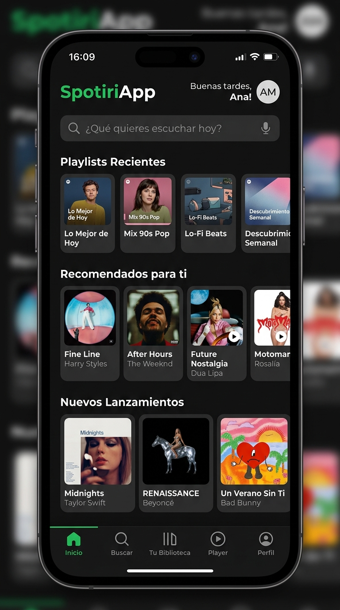

# 🎵 SpotiriApp 

Bienvenido a **SpotiriApp**

---

## 📱 Captura de Pantalla de la Aplicación



---

## 📂 Arquitectura de las 3 Pantallas

### 1. 🏠 Pantalla de Inicio (`src/screens/HomeScreen.tsx`)
- **Encabezado Contextual:** Saludo según la hora del día ("Buenas tardes 🎵") y avatar de usuario.
- **Buscador Dinámico (`<TextInput>`):** Permite ingresar texto para filtrar instantáneamente el catálogo de canciones y podcasts disponibles.
- **Filtros por Categoría (`<Pressable>`):** Chips de selección ("Todo", "Música", "Podcasts") con respuesta táctil y estilo activo.
- **Grilla de Acceso Rápido:** Disposición 2x3 con Flexbox de playlists escuchadas recientemente con carátulas remotas.
- **Lista de Canciones Filtrada:** Canciones con título, artista, contador de reproducciones e indicador sonoro de pista actual.
- **Banner Especial:** Tarjeta promocional "Radar de Novedades" con botón de llamada a la acción.

### 2. 🎧 Pantalla de Reproductor (`src/screens/PlayerScreen.tsx`)
- **Cabecera de Contexto:** Indicador de playlist de origen ("Top 50 - Global 🌎") y botón para minimizar.
- **Carátula en Alta Definición (`<Image>`):** Imagen remota destacada con bordes redondeados (`rounded-2xl`) y sombra nativa.
- **Información del Track & Favoritos:** Título, artista y botón interactivo `<Pressable>` que conmuta el estado de "Me Gusta".
- **Barra de Progreso y Tiempo:** Barra simulada con Flexbox en verde Spotify (`#1DB954`) con marcadores de tiempo transcurrido y duración total.
- **Controles de Audio Interactivos:**
  - Botón aleatorio (🔀) con estado activo.
  - Pista anterior (⏮) y pista siguiente (⏭) con opacidad al pulsar.
  - **Botón Play / Pause central:** Cambia el icono (`▶` / `⏸`) y estado al presionar con micro-animación táctil.
  - Repetir bucle (🔁) con estado activo.
- **Conectividad:** Estado del dispositivo de audio conectado (Bluetooth) y compartir.

### 3. 👤 Pantalla de Perfil (`src/screens/ProfileScreen.tsx`)
- **Banner Superior Panorámico (`<Image>`):** Imagen de cabecera con degradado sutil hacia el fondo oscuro.
- **Avatar Circular:** Foto de perfil con borde de acento verde Spotify superpuesta sobre el banner.
- **Información del Estudiante/Usuario:** Nombre ("Edgar Junior"), carrera, universidad y biografía.
- **Métricas con Flexbox:** Contador de Seguidores, Siguiendo y Playlists organizados en fila responsiva.
- **Interacciones Táctiles (`<Pressable>`):**
  - Botón interactivo de Seguir/Siguiendo con cambio de borde y texto.
  - Botón de Likes interactivo (`❤️ Likes: {likes}`) con retroalimentación inmediata al pulsar.
- **Sección Artistas Más Escuchados:** Scroll horizontal con avatares circulares de artistas favoritos.
- **Playlists Públicas:** Lista de colecciones musicales del usuario con carátulas remotas y conteo de pistas.

---

## 🎨 Paleta de Colores y Configuración de Tailwind

En `tailwind.config.js` se definieron los colores oficiales del ecosistema Spotify:
```javascript
colors: {
  spotifyGreen: '#1DB954',
  spotifyBlack: '#121212',
  spotifyDarkGray: '#181818',
  spotifyLightGray: '#282828',
}

## 👨‍💻 Autor
- **Estudiante:** Edgar Junior
- **Materia:** Desarrollo Móvil / Ingeniería de Sistemas
- **Institución:** Universidad de La Guajira
